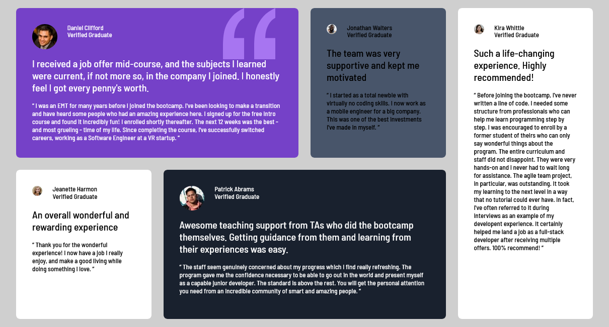

# Frontend Mentor - Testimonials grid section solution

This is a solution to the [Testimonials grid section challenge on Frontend Mentor](https://www.frontendmentor.io/challenges/testimonials-grid-section-Nnw6J7Un7). Frontend Mentor challenges help you improve your coding skills by building realistic projects. 

## Table of contents

- [Overview](#overview)
  - [The challenge](#the-challenge)
  - [Screenshot](#screenshot)
  - [Links](#links)
  - [Built with](#built-with)
  - [What I learned](#what-i-learned)
- [Author](#author)

## Overview

### The challenge

Users should be able to:

- mobile 375px;
- Laptop 1440px

### Screenshot

### Links

- Solution URL: [https://github.com/DajoshPlays/grid-testimonial-section]

## My process

### Built with

- Semantic HTML5 markup
- CSS custom properties
- Flexbox
- CSS Grid
- Mobile-first workflow
- For styles

### What I learned

I was able to learn about using grid template columns and grid template rows and the unit i should use with this property- it's best to use it with fractional size to be able to group our boxes to grid. then i was also able to use the order to rearrange them on the big screen because the order from the small screen changed.

## Author

- Website - [Adefila Joshua](https://www.your-site.com)
- Frontend Mentor - [@Dajoshplays](https://www.frontendmentor.io/profile/yourusername)
- Twitter - [@JoshuaAdefila1](https://www.twitter.com/yourusername)
-LinkedIn - [@joshuaadefila]
